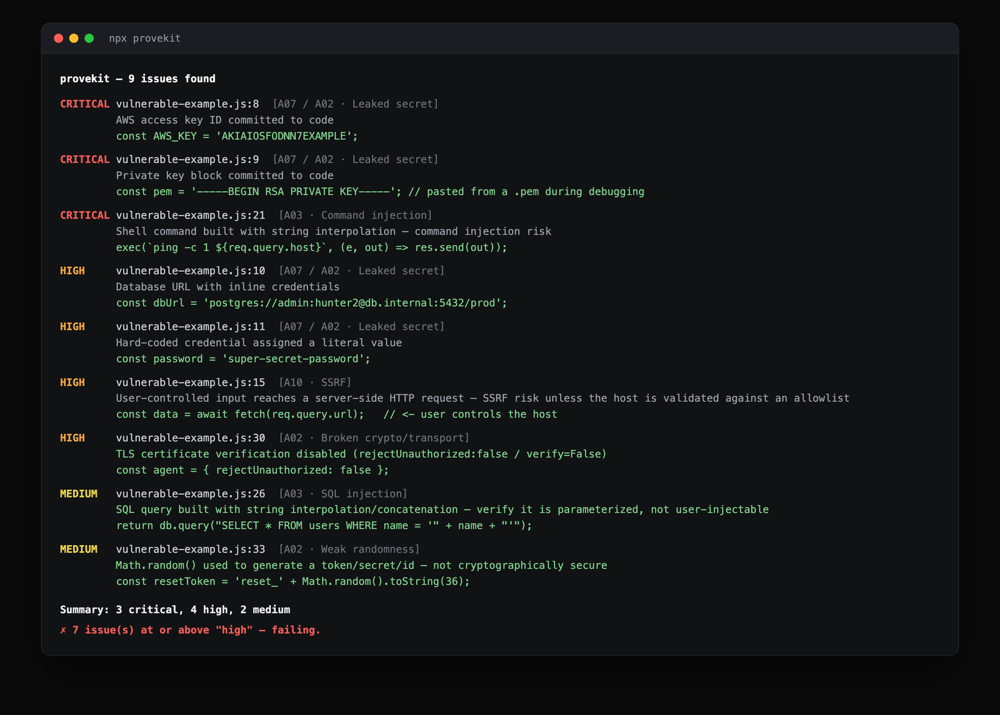
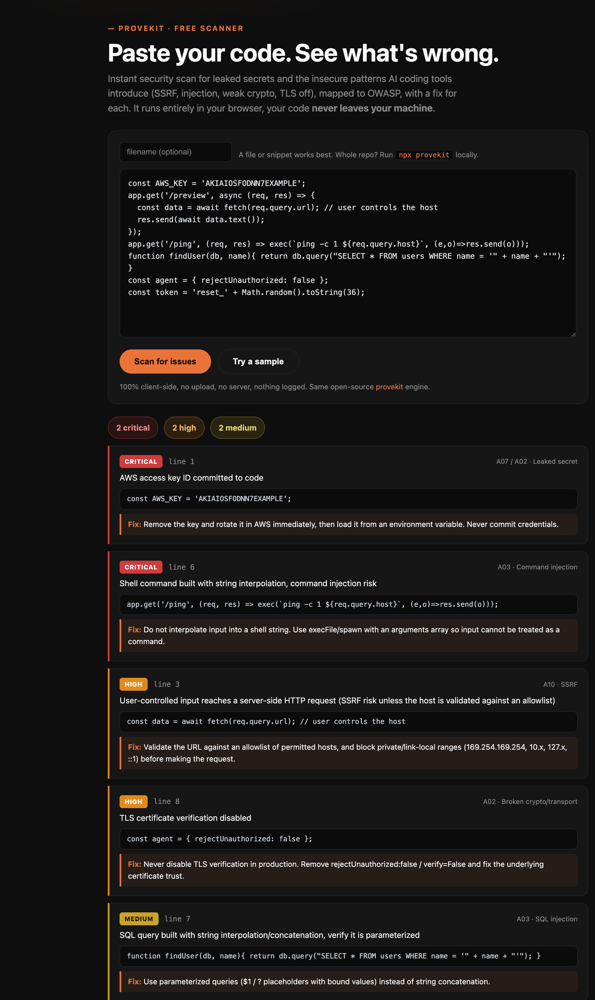

# provekit

**Attack-tested security scanning for AI-generated code.** Catches leaked secrets and the insecure patterns AI agents love to introduce, mapped to the OWASP Top 10. Zero dependencies, runs locally, gates your CI.

```bash
npx provekit
```



---

## Why this exists

Coding agents (Cursor, Claude Code, Copilot) ship code fast. They also paste API keys into files mid-debug, fetch user-controlled URLs with no guard, build SQL by string concatenation, and disable TLS verification, and they do it in fluent, convincing code that looks fine in review.

`provekit` reads the code your agents write and flags the security mistakes they actually make, before it merges. It's built to be **precise**: it won't cry wolf on code that's already guarded, because a scanner you can't trust is a scanner you turn off.

Precision in practice: it skips parameterized SQL, env-var reads, bcrypt/argon hashes, and placeholder values, and in `test/`, `examples/`, and fixture files it stays quiet on the insecure things test code does on purpose (disabling TLS, fake secrets) while still catching a **real** leaked key anywhere. On axios + express (372 files, heavily audited) it reports zero findings; on a file full of planted vulnerabilities it finds all nine.

## What it catches

| OWASP | Examples |
|---|---|
| **A07 / A02 — Leaked secrets** | AWS / GitHub / Stripe / OpenAI / Anthropic keys, private-key blocks, DB URLs with inline credentials, hard-coded passwords |
| **A10 — SSRF** | user-controlled input reaching a server-side HTTP request with no host allowlist |
| **A03 — Injection** | `eval` / `new Function`, shell commands built by string interpolation, SQL by concatenation, `innerHTML` / `dangerouslySetInnerHTML` |
| **A02 — Broken crypto/transport** | TLS verification disabled, MD5/SHA1 for passwords, `Math.random()` for tokens |
| **A05 — Misconfiguration** | wildcard CORS, debug mode on |

## See it work

**In your browser, no install:** paste code into the free web scanner at **[xkaii.studio/labs/scanner](https://xkaii.studio/labs/scanner)**. It runs 100% client-side, your code never leaves the page.



Or run it locally on the bundled example:

```bash
git clone https://github.com/Th3Circle-app/provekit && cd provekit
npm run demo
```

Both surfaces run the same engine and produce the CLI report shown at the top: 9 issues on the planted-vulnerability sample, grouped critical → high → medium, each with an OWASP mapping and a one-line fix.

## Usage

```bash
provekit                 # scan your uncommitted changes (the AI-code use case)
provekit --staged        # scan staged changes — great as a pre-commit hook
provekit --diff main     # scan everything changed vs a branch — great in CI on a PR
provekit <files...>      # scan specific files
provekit --all           # scan every tracked source file
provekit --fail-on medium --json
```

Add `// provekit-ignore` to a line to whitelist a false positive.

### In CI (GitHub Actions)

```yaml
# .github/workflows/provekit.yml
name: provekit
on: [pull_request]
jobs:
  scan:
    runs-on: ubuntu-latest
    steps:
      - uses: actions/checkout@v4
        with: { fetch-depth: 0 }
      - run: npx provekit --diff origin/${{ github.base_ref }}
```

The scan fails the build on any `high`+ finding, so insecure AI-generated code can't merge.

## Who's behind it

Built by [Harrison C. Songolo](https://xkaii.studio/security), who does this for real: found, fixed, and responsibly disclosed live [SSRF vulnerabilities in open-source tools](https://github.com/Th3Circle-app/security-assessments), and built [redteam-loop](https://github.com/Th3Circle-app/redteam-loop), an AI-in-the-loop system that attacks a service, has an LLM propose a fix, and re-runs the exact attack to prove it closed. This tool is the fast, free front end of that same discipline.

## Roadmap

`provekit` today is static pattern detection, fast and precise. The next step is the thing nobody else does: **adversarial verification**, actually firing the exploit at a running copy and proving the control holds, not just guessing from the source. That's [redteam-loop](https://github.com/Th3Circle-app/redteam-loop), and it's where this is headed.

MIT. Contributions and new rules welcome, open an issue.
